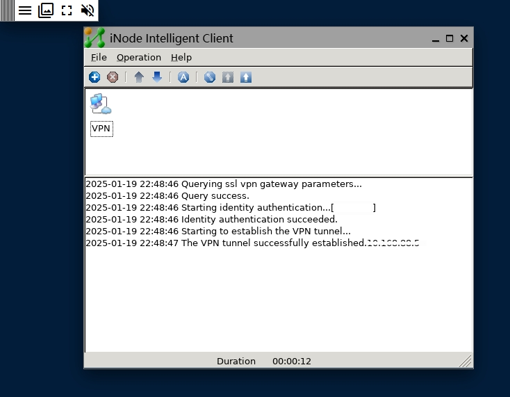

## 说明

由于 iNode VPN 没有提供公开协议和 cli 的vpn 客户端，必须使用 UI 进行设定和连接，想在在路由器端设定路由或代理实现 vpn 网络的透明访问

实现思路：在 docker 中启动一个虚拟显示，进行vpn 的设定和连接，并提供 ***路由转发*** 和 ***http代理*** 功能。然后在（软）路由再设定路由转发到 docker 的容器IP

官网：https://www.h3c.com/cn/Service/Document_Software/Software_Download/Intelligent_Management/iNode/iNode_PC/


## 使用

### 安装
使用 Docker 或 Docker Compose 运行镜像

#### Docker 
```shell
docker run -d --name inode-vpn \
--privileged \
-p 14500:14500 \
-p 3128:3128 \
-v /etc/localtime:/etc/localtime:ro \
-v /etc/timezone:/etc/timezone:ro \
-v ./var/log:/opt/iNodeClient/log \
-v ./var/conf:/opt/iNodeClient/conf \
-v ./var/clientfiles:/opt/iNodeClient/clientfiles \
h3c-inodevpn-proxy:7.3-e632
```
#### Docker Compose
```yml
services:
  inode-vpn:
    image: h3c-inodevpn-proxy:7.3-e632
    ports:
      - "14500:14500"
      - "3128:3128"
    privileged: true
    environment:
      - TZ=Asia/Shanghai                  # 设置环境变量（可选）
    volumes:
      - /etc/localtime:/etc/localtime:ro  # 挂载主机时区文件
      - /etc/timezone:/etc/timezone:ro    # 挂载主机时区信息
      - ./var/log:/opt/iNodeClient/log:rw
      - ./var/conf:/opt/iNodeClient/conf:rw
      - ./var/clientfiles:/opt/iNodeClient/clientfiles:rw
    networks:
      inode-vpn-net:
        ipv4_address: 172.148.1.254
networks:
  inode-vpn-net:
    driver: bridge
    ipam:
      config:
        - subnet: 172.148.1.0/24
```
配置

在 UI 中设定账户信息，设定自动登录后，vpn随容器启动连接




## 编译方法

这里以 7.3_E632 版本为例，其他版本请自行替换
1. 下载通用 Linux 版 iNodeClient 安装包 ```iNodeClient_Linux_X64_7.3_E632.tar.gz``` 并复制到项目路径
2. 执行编译 ```docker build -t h3c-inodevpn-proxy:7.3-e632 .```
